# Conceptual ER Overview

This system models a **music listening analytics platform** where users upload or sync listening data, which is then enriched, stored, and queried for insights (e.g., top artists, tracks, time listened).

# Core Entities and Relationships

## Relationship overview



## User (Central Entity)

The **User** is the root of the system.

A user:

- Owns all listening history
- Has authentication sessions
- Connects external platforms (e.g., Spotify)
- Defines exclusions (filters)

### Relationships:

- 1 → N with ListeningHistory
- 1 → N with InternalAuthSessions
- 1 → N with ConnectedPlatforms
- 1 → N with Exclusion

---

## ListeningHistory (Event Entity)

This represents a **single listening event** (a track played at a specific time).

Each record captures:

- What was played (`trackName`, `albumName`)
- When (`playedAt`)
- How long (`durationMs`)
- Source (upload vs API)
- Raw metadata (JSON)

### Key Characteristics:

- Composite uniqueness:
  `(userId, platformTrackId, playedAt)`
  => prevents duplicate ingestion
- Indexed by `(userId, playedAt)` for fast time-based queries

### Relationships:

- N → 1 with User
- N ↔ M with Artist

---

## Artist

Artists are **normalized entities** shared across tracks.

### Why separate Artist?

- Avoids duplication across listening entries
- Enables aggregation (top artists, filtering, etc.)
- Allows enrichment (genres, images, platform IDs)

### Relationships:

- M ↔ N with ListeningHistory

Meaning:

- A track can have multiple artists
- An artist can appear in many listening events

---

## InternalAuthSessions (Authentication Layer)

Represents **refresh token sessions**.

### Design Decisions:

- Each user has **one active session** (`userId @unique`)
- Stores:
  - Hashed refresh token
  - Expiry timestamp

### Relationships:

- N → 1 with User

### Purpose:

- Enables secure token rotation
- Allows session invalidation (in case of logout, compromise)

---

## ConnectedPlatforms (External Integrations)

Represents connections to platforms like Spotify.

Each record stores:

- Platform identity (`platformName`)
- Platform user ID
- OAuth tokens (access + refresh)
- Expiry

### Constraints:

- One connection per platform per user

### Relationships:

- N → 1 with User

### Purpose:

- Enables:
  - Fetching listening history (API)
  - Enrichment (artist IDs, metadata)

---

## Exclusion (User Personalization)

Allows users to **exclude artists or tracks** from analytics.

Each exclusion:

- Targets either:
  - `artist` OR `track`

- Stores metadata for display:
  - name
  - artistName
  - albumName

### Constraints:

```
(userId, type, targetId) UNIQUE
```

### Relationships:

- N → 1 with User

### Purpose:

- Filters data in:
  - analytics queries(top-artists, top-tracks, etc)

# Data Flow Perspective

## 1. Data Ingestion

- User uploads history OR syncs via platform
- ListeningHistory entries are created
- Artists are linked (initially setting their platforms specific IDs as "pending", later enriched)

## 2. Enrichment

- Background workers:
  - Resolve artist IDs via platform APIs
  - Normalize Artist entities

## 3. Query Layer

- Aggregations run on ListeningHistory:
  - Top artists
  - Top tracks
  - Time listened

- Exclusions are applied dynamically

## 4. Authentication

- Sessions stored in InternalAuthSessions
- Tokens rotated securely

---
